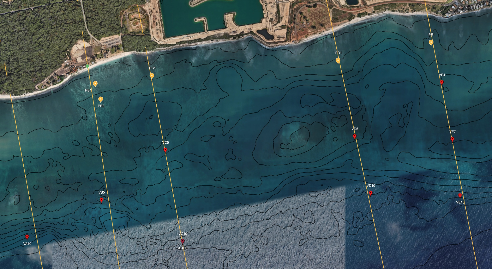
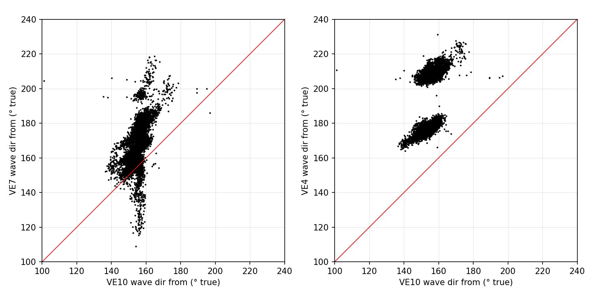

# 4EWA

# Data Processing and Analysis for 4EWA (placeholder for cool project name)

Contents:
I. Data Collection
II. Quality Control 

## Data Collection
A two-dimensional array of bottom mounted sensors including 5 Pressure sensors, 9 Norterk ADVs, 1 Nortek Signature 1000 were deployed in the Ewa Beach region of Oahu, Hawaii from 07/28/2026 to 09/16. Please see associated .kml file for sensor locations and feel free to holla at i1rojas@ucsd.edu for data requests

Lidar line scans with associated day-long RBR deployments in the nearshore were also conducted on select dates. 

### Sensor Naming Convention

- **First letter**: sensor type. V = Nortek Vector (ADV), P = Paroscientific pressure sensor. The Signature 1000 is `ADCP`.
- **Second letter**: transect line, A–E from west to east.
- **Number**:
  - Vectors: approximate deployment depth in meters (e.g. `VA10` = Vector, transect A, ~10 m).
  - Pressure sensors: order along the transect from nearshore (e.g. `PB1`, `PB2`).

Vector IDs were changed on 2026-10-03. The old IDs numbered sensors nearshore → offshore:

| ID | old ID | S/N | depth (m) |
|---|---|---|---|
| VA10 | VA1 | 8190 | 10 |
| VB5 | VB1 | 9649 | 5.5 |
| VC5 | VC1 | 12411 | 5 |
| VC10 | VC2 | 15241 | 10 (co-located with ADCP) |
| VD5 | VD1 | 12596 | 5 |
| VD10 | VD2 | 8195 | 10 |
| VE4 | VE1 | 15254 | 4 |
| VE7 | VE2 | 15056 | 7 |
| VE10 | VE3 | 15048 | 10 |

## Data Processing

### Data files
- `data/processed/{SENSOR}_raw.nc`: all `.vec` files for one Vector merged, with deployment metadata from `sensor_notes.csv` attached.  Produced by `processing/adv_raw2nc.ipynb`.
- `data/processed/qc/{SENSOR}_QC.nc`: final QC'd product, written at the end of `processing/adv_QC.ipynb`. Every QC choice is recorded in the global attributes (`qc_*`, `rot_*`, `zt_*`).
- Executed QC notebook for each sensor: `processing/qc_runs/adv_QC_{SENSOR}.ipynb`.

### ADVs

#### File Type Conversion
raw data files (.vec) were converted to .nc files using the Dolfyn package. Each ADV contains four .VEC files. The workflow for processing the ADV data is as follows:
1. Combine the four .vec files into a single .nc file using the `dolfyn` package and manifest.csv.
2. Add metadata (sensor_notes.csv)
3. Save as `{SENSOR}_raw.nc`.

**NOTE** had to truncate the fourth .vec file for each ADV. The last chunk of data was corrupted because it was hard stopped once it was connected to nortek software.

#### Initial Quality Control (`processing/adv_QC.ipynb`)
QC steps, in the order they are applied:
- **Seam fillers dropped**: placeholder records at `.vec` file boundaries (p = 0, all beam correlations = 0) are removed.
- **Clock drift**: linear correction from 0 at the first raw sample to the measured drift (`sensor_notes.csv`) at the last. VE4 has an override, documented in `DRIFT_OVERRIDE`.
- **In-water trim**: keep the longest run with $p \geq 3$ dbar. Shrink it to where the 1-min heading std is calm, which cuts diver handling. Then remove a 10 s buffer from each end.
- **Atmospheric pressure**: subtract the NOAA 1612340 (Honolulu) hourly barometer, using the pre-deployment in-air offset. The raw channel is kept as `p_raw`.
- **Sound speed**: velocities are rescaled from the configured salinity (33.5) to 35 PSU (~0.1 %).
- **Correlation gate**: a velocity sample is bad if any beam correlation is below $0.3 + 0.4 \sqrt{f_s/25}$. That is 41.3 % at $f_s = 2$ Hz.
- **Replacement of bad samples**:
  - Runs of bad samples $\leq 1$ s are linearly interpolated between the good samples on either side.
  - Longer runs are replaced by a 1-s running mean of the recorded values.
  - `vel_qc_flag` marks each sample: 0 = measured, 1 = linear interpolation, 2 = 1-s running mean. No velocity NaNs remain.
- **SNR flag** (Elgar et al., 2005): $\mathrm{SNR} = 0.43\,\mathrm{dB/count} \times (\mathrm{amp} - \mathrm{in\text{-}air\ noise\ floor})$. `vel_low_snr` marks samples with any beam $\mathrm{SNR} < 8$ dB.
  - BS's run rule ($\leq 0.81\%$ low-SNR samples) is stored per hour as `seg_snr_ok`, as a flag only.
  - The sensors are always submerged. Low SNR here means clear water, and those samples are only ~1.5× noisier.
- **Hourly segment flag**: `seg_ok` = the 1-h segment has $\leq 10\%$ running-mean velocity (`seg_runmean_ok`) **and** passes the $z^2$ test below (`z2_ok`). `seg_interp_pct` and `seg_runmean_pct` give the hourly fractions.

- **Rotation**: KVH magnetic heading + 9.26° E declination, head up (roll 180°). The result is true ENU (`u_east`, `v_north`) and then shore-normal per transect (`u` onshore, `v` alongshore, `w` up).
  - **Sign convention**: **$+u$ = onshore** (toward shore). **$+v$ = alongshore toward the west**, which is 90° counter-clockwise from $+u$ (to your left when you face the beach). **$+w$ = up**. $(u, v, w)$ is a right-handed frame. Each sensor's exact bearings are stored in the `long_name` of `u` and `v` in `{SENSOR}_QC.nc`:

    | transect | sensors | $+u$ toward (° true) | $+v$ toward (° true) |
    |---|---|---|---|
    | A | VA10 | 355 | 265 |
    | B | VB5 | 336 | 246 |
    | C | VC5, VC10 | 350 | 260 |
    | D | VD5, VD10 | 339 | 249 |
    | E | VE4, VE7, VE10 | 3 | 273 |
- **$z^2$ test**: compares measured pressure variance with the pressure variance linear theory predicts from horizontal velocity,

  $$z^2 = \frac{p^2}{\left(\frac{\omega}{g k}\right)^2 \frac{\cosh^2(k d_p)}{\cosh^2(k d_u)} \left(u^2 + v^2\right)}$$

  - Integrated over the wind-wave band, $0.05 < f < 0.20$ Hz, for each clock hour (`z2`).
  - An hour is rejected (`z2_ok` and `seg_ok` False) unless $0.5 < z^2 < 2.0$. No samples are removed.
  - Hours with less than 99 % of their samples, or an internal gap over 2 s (e.g. partial first and last hours), get no $z^2$ and fail.
  - `zt_status` summarizes the record median.

References:
 - Elgar, S., Raubenheimer, B., & Guza, R. T. (2005). Quality control of acoustic Doppler velocimeter data in the surfzone. *Measurement Science and Technology*, 16, 1889–1893. doi:10.1088/0957-0233/16/10/002 (`lit/`)

#### Quality Control (ADCP, `processing/adcp_QC.ipynb`)
The same steps adapted for the Signature 1000 (4 Hz, 23 cells), plus a side-lobe surface mask and a seconds-level clock check against the co-located VC10. The final product is `data/processed/qc/ADCP_qc.nc`.
- **Correlation, SNR, replacement and $z^2$** follow the ADV rules (Elgar et al., 2005):
  - The correlation gate is $0.3 + 0.4 \sqrt{f_s/25}$ = 46.0 % at $f_s = 4$ Hz.
    - Caveat: the $\sqrt{f_s}$ scaling assumes more pings averaged per sample, which is not established for the Signature's 4 Hz burst.
  - Bad samples are replaced per beam and cell, before rotation: runs $\leq 1$ s by linear interpolation, longer runs by a 1-s running mean.
  - Samples above the side-lobe limit stay NaN and are never replaced.
- **`qc` flag bits:** 1 low correlation, 2 above the side-lobe limit, 4 1-s running mean, 8 linear interpolation, 16 $\mathrm{SNR} < 8$ dB.
- **Hourly table** (`ADCP_qc_hourly.nc`, per hour and cell):
  - the flag percentages;
  - `seg_snr_ok` (flag only);
  - $z^2$ over 0.05–0.20 Hz (`z2`, `z2_ok`);
  - `seg_ok` = $\leq 10\%$ running mean AND $0.5 < z^2 < 2.0$.

## Bulk Statistics
- **512 s bulk-stats QC** (`processing/adv_QCBulk.ipynb`, kernel `analysiz`): each Vector's QC'd record (`{SENSOR}_QC.nc`) is split into 512 s segments (segments with $< 99\%$ of samples are skipped), and per segment it computes:
  - `Hs`: pressure → $\eta$ with the granolas $\cosh(kh)$ transfer function (`depth_correct_eta`, cut at 0.25 Hz), Welch PSD (128 s windows), $H_s = 4\sqrt{m_0}$ over 0.04–0.25 Hz.
  - `u`, `v`: mean cross-shore (+ onshore) and alongshore (+ westward) velocity. See the sign convention under Rotation.
  - `cur_dir`: direction the mean current flows toward (deg true), from mean `u_east`, `v_north`.
  - `wave_dir`: wave direction of travel (deg true) from the p–velocity co-spectrum over 0.04–0.25 Hz. This is the same method as `wave_dir_h` in `adv_QC.ipynb`.
  - Each variable is plotted per sensor in 3-week panels with a grey line every 3 h (`figs/qc/ADV_{var}512_{SENSOR}.png`), and the plots are inspected by eye for spikes. The table is saved to `data/processed/qc/adv_bulk512.csv`. Nothing stood out in Hs.

| ID | old ID | S/N | depth (m) |
|---|---|---|---|
| VA10 | VA1 | 8190 | 10 |
| VB5 | VB1 | 9649 | 5.5 |

|Sensor|Segments|Hs [m]|u [m/s]|v [m/s]| 
|---|---|---|---|---|
|VA10 |   9935 segments  | Hs 0.50-6.05 m | u -0.28 to +0.09 |  v -0.33 to +0.30 m/s|
|VB5 |   9769 segments   | Hs 0.51-3.47 m   | u -0.24 to +0.62   | v -0.64 to +0.37 m/s|
|VC5 |   9918 segments   | Hs 0.44-2.48 m   | u -0.32 to +0.10   | v -0.75 to +0.27 m/s|
|VC10|   9779 segments   | Hs 0.46-4.76 m   | u -0.19 to +0.07   | v -0.38 to +0.30 m/s|
|VD5 |   9953 segments   | Hs 0.39-2.90 m   | u -0.37 to +0.28   | v -0.45 to +0.38 m/s|
|VD10|   9782 segments   | Hs 0.35-5.18 m   | u -0.34 to +0.16   | v -0.31 to +0.31 m/s|
|VE4 |   9965 segments   | Hs 0.39-2.34 m   | u -0.64 to +0.14   | v -0.55 to +0.42 m/s|
|VE7 |   9976 segments   | Hs 0.37-2.7git0 m   | u -0.30 to +0.10   | v -0.30 to +0.22 m/s|
|VE10|   9772 segments   | Hs 0.34-4.96 m   | u -0.32 to +0.11   | v -0.44 to +0.33 m/s|

## Figures
- `figs/orientation/`: internal compass pitch, roll, heading and tilt of every sensor, to sanity check the Vector probes.
- `figs/qc/initial`: one set per sensor: `{SENSOR}_trim`, `_clock_tide`, `_beam`, `_fill`, `_rotate`, `_ztest`. `clock_drift_all.png` covers every sensor.
- `figs/qc/bulk`: one set per sensor, showing Hs, wave direction, u, v, andcurrent direction. 

## Future Figures
Planned exploratory figures from the hourly bulk statistics. Each one is paired with the question it is meant to open. Request them by number once the inputs are verified.

### A. Overview and events
1. **Deployment overview stack.** The panels are:
   - Buoy Hs, Tp and Dp.
   - The tide.
   - Swell-band Hs at every sensor, colored by transect, with a line style for each depth.

2. **Pressure spectrogram per sensor** (log f × time). Look for dispersive swell arrivals (frequency rising over days), which give the source distance and time. *Do arrivals differ across the array, which would mean refraction or sheltering?*

### B. Spatial structure of waves
3. **Map panels** (lat/lon from `sensor_notes.csv`):
   - $H_{s,\mathrm{swell}} / H_{s,\mathrm{ref}}$ as dots.
   - Mean ENU current vectors.
   - Shown as an event composite, a calm composite, and their difference.

   *Is the alongshore Hs gradient bigger during south swell, from reef or bathymetric focusing?*
4. **Cross-shore transformation.** $H_s$ against $h$ along each transect (B, C, D, E; A has only 10 m). Show the event mean $\pm$ spread, with the linear shoaling prediction from the 10 m reference overlaid. *Where does dissipation start, and does it differ between transects (reef roughness)?*
5. **Alongshore variability at fixed depth.**
   - The ~5 m line (VB5, VC5, VD5, VE4) and the 10 m line (VA10, VC10, VD10, VE10).
   - Hs and direction against alongshore position, plotted against buoy direction.

   *Does a change in incident direction switch which part of Ewa gets the energy?*
6. **Infragravity.** $H_{s,\mathrm{IG}} / H_{s,\mathrm{swell}}$ against $H_{s,\mathrm{swell}}$ and against $T_p$, plus a map of the IG fraction during events. *Bound vs free IG? Is IG enhanced shoreward on the reef transects?*

### C. Currents in time
7. **Tidal ellipse map.** M2 and K1 per sensor, and per depth bin for the ADCP. *Is the tidal flow rectified or phase-lagged along the coast?*
8. **Subtidal current stack.** Alongshore and cross-shore at each sensor, with events shaded and the wind and buoy Hs alongside. *Do events drive alongshore flow, or does the trade-driven background dominate?*
9. **ADCP Hovmöller.** Hourly u and v (time × height), plus mean profiles for events vs calm. *Does undertow appear at 10 m? Is the profile sheared during swell?*

### D. Forcing–response and spatial scales
10. **Forcing scatter plots**, colored by event or calm:
    - Alongshore subtidal $v$ against $S_{xy}$ (or $H_s^2 \sin 2\theta$).
    - Cross-shore $u$ against $H_s^2/h$ (undertow scaling).

    *Is the wave-driven fraction measurable at 5 and 10 m?*
11. **Inter-sensor correlation against separation** for subtidal v and Hs_swell. Split the pairs into alongshore and cross-shore, and fit e-folding length scales for events vs calm. *Does swell shorten or lengthen the current coherence scale?*
12. **EOF of the subtidal ENU currents** across all sensors: mode maps, and PC time series against forcing. *Is there a coherent array-wide mode, such as a recirculation cell?*
13. **Cross-spectra or lag correlation** of the swell-band energy flux between the 10 m and 5 m sensors on each transect. *How much of the flux reaches 5 m, and how does that differ by transect?*

**Phase 2 (after Paros QC):** extend 4, 6 and 13 to the Paros depths. This adds the shallow end of each transect and IG near shore.

#### A note on prong head motion

Upon recovery, three ADVs (VB5, VE4, VE7) were found to have become dislodged from their plastic mounts, which attached the prong head to the vertical aluminum post on the frame mount. The movement can best be seen when computing bulk statisics, particularly wave direction.

For VE4 and VE7, BS suggest using the more offshore sensor VE10 to see if an offset can be applied. Show below are figures containing the wave direction between VE10 and VE4/VE7, respectively. 

# Running to do list

- ~~convert .vec files to .nc~~
- ~~inspect kvh files, gopro vids, and field notebook for accurate headings~~
- ~~rotate to earth frame~~
- Paros pressure sensor QC
- save final QC'd product to `data/processed/qc/`

