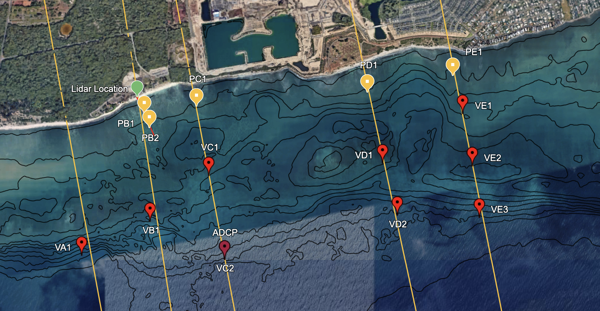

# 4EWA

# Data Processing and Analysis for 4EWA (placeholder for cool project name)

## Data Collection
A two-dimensional array of bottom mounted sensors including 5 Pressure sensors, 9 Norterk ADVs, 1 Nortek Signature 1000 were deployed in the Ewa Beach region of Oahu, Hawaii from 07/28/2026 to 09/16. Please see associated .kml file for sensor locations and feel free to holla at i1rojas@ucsd.edu for data requests

Lidar line scans with associated day-long RBR deployments in the nearshore were also conducted on select dates. 

### Sensor Naming Convenction

First letter signifies whether it is a vector (V) or pressure sensor (P)

Second letter signifies the transect line ,from east to west, A, B, C, D, E respectively

Third letter is the sensor type number from nearshore to offshore. 

## Data Processing

### ADVs - completed 9/23
raw data files (.vec) were converted to .nc files using the Dolfyn package. Each ADV contains four .VEC files. The workflow for processing the ADV data is as follows:
1. Combine the four .vec files into a single .nc file using the `dolfyn` package and manifest.csv.
2. Add metadata (sensor_notes.csv)
3. Process the .vec files into a single .nc file using the `dolfyn` package and manifest.csv.

**NOTE** had to truncate the fourth .vec file for each ADV. The last chunk of data was corrupted because it was hard stopped once it was connected to nortek software. 

# Running to do list

9/24:
- convert .vec files to .nc
- despiking
- inspect kvh files, gopro vids, and field notebook for accurate headings
- rotate to earth frame 

## Figures
- /orientation : pitch, roll, heading, and tilt of all sensors to sanity check vector probes. 

